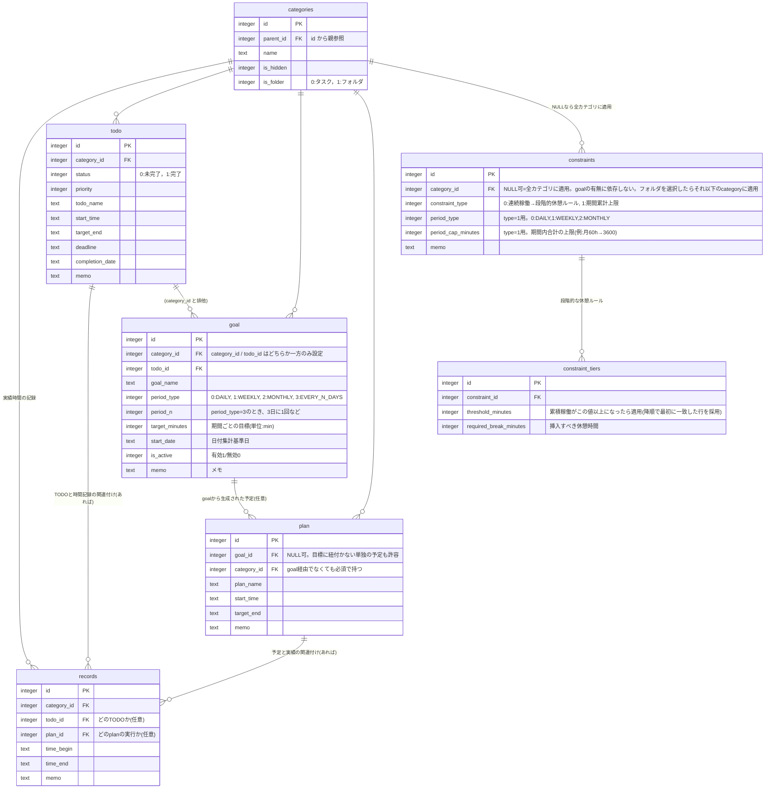

# ERD

```mermaid
erDiagram
    categories ||--o{ records : "実績時間の記録"
    categories ||--o{ todo : ""
    todo ||--o{ records : "TODOと時間記録の関連付け(あれば)"
    categories ||--o{ goal : ""
    todo ||--o{ goal : "(category_id と排他)"
    goal ||--o{ plan : "goalから生成された予定(任意)"
    categories ||--o{ plan : ""
    categories ||--o{ constraints : "NULLなら全カテゴリに適用"
    constraints ||--o{ constraint_tiers : "段階的な休憩ルール"
    plan ||--o{ records : "予定と実績の関連付け(あれば)"

    categories {
        integer id PK
        integer parent_id FK "id から親参照"
        text name
        integer is_hidden
        integer is_folder "0:タスク，1:フォルダ"
    }

    records {
        integer id PK
        integer category_id FK
        integer todo_id FK "どのTODOか(任意)"
        integer plan_id FK "どのplanの実行か(任意)"
        text time_begin
        text time_end
        text memo
    }

    todo {
        integer id PK
        integer category_id FK
        integer status "0:未完了，1:完了"
        integer priority
        text todo_name
        text start_time
        text target_end
        text deadline
        text completion_date
        text memo
    }

    goal {
        integer id PK
        integer category_id FK "category_id / todo_id はどちらか一方のみ設定"
        integer todo_id FK
        text goal_name
        integer period_type "0:DAILY, 1:WEEKLY, 2:MONTHLY, 3:EVERY_N_DAYS"
        integer period_n "period_type=3のとき、3日に1回など"
        integer target_minutes "期間ごとの目標(単位:min)"
        text start_date "日付集計基準日"
        integer is_active "有効1/無効0"
        text memo "メモ"
    }

    plan {
        integer id PK
        integer goal_id FK "NULL可。目標に紐付かない単独の予定も許容"
        integer category_id FK "goal経由でなくても必須で持つ"
        text plan_name
        text start_time
        text target_end
        text memo
    }

    constraints {
        integer id PK
        integer category_id FK "NULL可=全カテゴリに適用。goalの有無に依存しない。フォルダを選択したらそれ以下のcategoryに適用"
        integer constraint_type "0:連続稼働→段階的休憩ルール, 1:期間累計上限"
        integer period_type "type=1用。0:DAILY,1:WEEKLY,2:MONTHLY"
        integer period_cap_minutes "type=1用。期間内合計の上限(例:月60h→3600)"
        text memo
    }

    constraint_tiers {
        integer id PK
        integer constraint_id FK
        integer threshold_minutes "累積稼働がこの値以上になったら適用(降順で最初に一致した行を採用)"
        integer required_break_minutes "挿入すべき休憩時間"
    }
```
